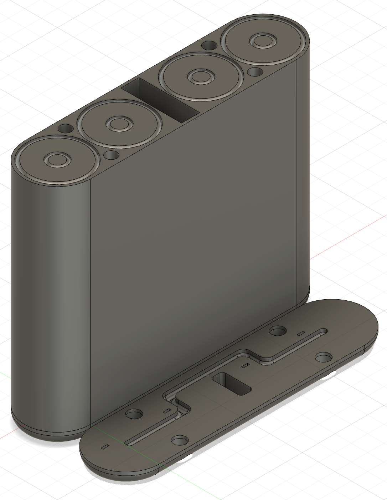

# PowerBank

Minimal DIY power bank with USB-C and fast charging.

## Overview

This minimal DIY power bank features a custom-designed case created in Fusion 360 to securely hold four 18650 lithium-ion cells, providing a robust and compact power source. The enclosure is tailored to fit the battery pack and the custom PCB, ensuring a neat and durable assembly. The PCB, designed in KiCad, incorporates the IP2312 charging IC for safe and efficient battery charging and the Texas Instruments TPS61022 boost converter to step up the battery voltage to a stable 5 V output. Both the USB-C input and output ports support up to 3A current, enabling fast charging and discharging capabilities suitable for modern devices.

The TPS61022 boost converter is a high-efficiency synchronous step-up converter capable of delivering 5 V at 3 A with an input voltage range from 0.5 V to 5.5 V, making it ideal for single-cell lithium-ion battery applications. It operates at a high switching frequency (up to 1 MHz) for low ripple and efficient power conversion, and includes protections such as overvoltage, thermal shutdown, and short-circuit protection.

The IP2312 charging IC manages the charging process of the 18650 cells, ensuring battery safety and longevity.

The power bank includes simple charge indicators showing charging in process and completion, though it currently lacks device charging or battery state indicators, maintaining a minimalist design focused on core functionality. This DIY power bank is ideal for enthusiasts seeking a custom, efficient, and compact portable power solution.

